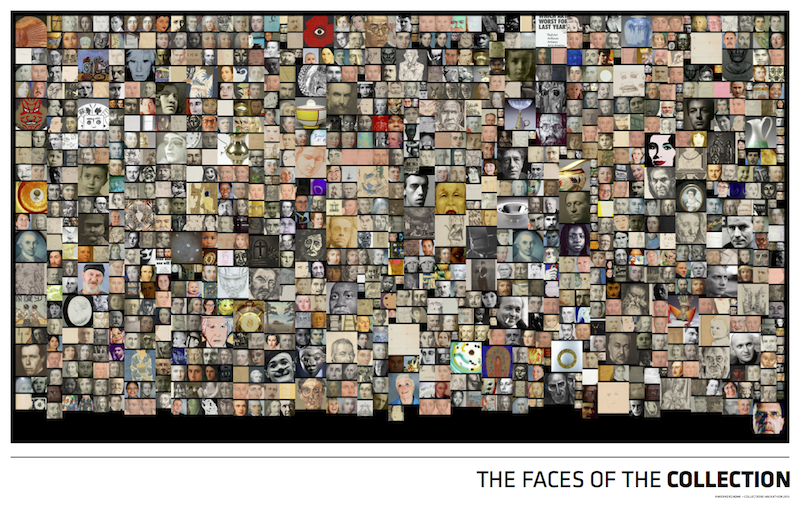

# The Faces of the Collection



Developed as part of the [Carnegie Museum of Art's Hackathon](http://www.cmoa.org/hackathon), this is a application that uses the CMOA dataset to download all of the images in the collection, detect faces in the artwork, and then generate a single image containing of all of the faces within the collection.

This repository contains code in several languages, but is designed to be cloned within the ``apps/myApps/`` directory within an installation of openFrameworks, installed on OSX. It will likely work on other environments, but you may have to adjust things as needed.

## Software Used:

* [openFrameworks](http://openframeworks.cc)
* [OpenCV](http://opencv.org)
* [webkit2png](http://www.paulhammond.org/webkit2png/)
* [Python SimpleHTTPServer](https://docs.python.org/2/library/simplehttpserver.html)
* [Ruby](https://www.ruby-lang.org/en/)
* [Typhoeus](https://github.com/typhoeus/typhoeus)
* [Isotope](http://isotope.metafizzy.co)

## Instructions for use

This software was written over a weekend as part of a hackathon, so it's not nearly as clean or concise as it could be, and it uses many different programming languages and tools.  As such, it's not the easiest thing to get running—there are a lot of dependencies involved.  This document tries to explain the process.

#### Step One: Download the collections data.

The Carnegie Museum has all of its collection metadata hosted on github at <https://github.com/cmoa/collection>.  This project uses the [JSON version](https://github.com/cmoa/collection/blob/master/cmoa.json) of the dump to parse through and find the links to all of the thumbnail images.

We can download that data using [curl](http://curl.haxx.se):

```bash
curl -o ./bin/data/cmoa.json https://raw.githubusercontent.com/cmoa/collection/master/cmoa.json
```

This will give us a large JSON file.

#### Step Two: Download the Images

To download the images contained within the dump, we can use Ruby and the Typhoeus gem to download the images in parallel.  the `download_em_all.rb` script will do this.

to install the dependencies, we use [Bundler](http://bundler.io):

```bash
bundle install
```

We can then run the script and download the images.

```bash
bundle exec ruby download_em_all.rb
```

For reasons that *mostly* have to do with the CMOA backend (but also have to do with my code), this process is somewhat unreliable and needs to be run multiple times to successfully download all the images.  Everytime it runs, it makes sure that it doesn't redownload the images it already has. 

You'll know when it stops working when it stops saying "OK" after the URLS.  

Once it doesn't download anything new, we now have all the images! 

#### Step Three: Detect the Faces.

In order to do the facial detection, we're using [OpenCV](http://opencv.org), an extremely powerful open source computer vision library.  We're going to use it via [openFrameworks](http://openframeworks.cc), a C++ framework for creative coding. Many people use xCode to run openFrameworks, but I prefer using the makefiles instead.  The following command should compile the application and then execute it:

```bash
make && make run
```

This application will go through all the images downloaded to detect faces within them.  Every time it finds a face, it will save out an PNG of the first detected face into the `bin/data/downloaded_faces` directory.

#### Step Four: Generate the Final Image

We're using the [Isotope](http://isotope.metafizzy.co) javascript library to build a binpacked grid of the images as a webpage.  However, we don't actually have a webpage yet, so we'll use another ruby script to generate a webpage for us:

```bash
ruby export_image_grid.rb
```
This should create a HTML file for us.

In my effort to use as many languages as possible, we're now going to use python's SimpleHTTPServer to host a server for the directory:

``
python -m SimpleHTTPServer 8008 
``
This will start serving the files in this directory as webpages. We will then open that webpage using [webkit2png](http://www.paulhammond.org/webkit2png/), which will open the webpage and save it as an image.

In a new terminal window:
``
webkit2png -W 2400 -F --delay=10 --filename final_image --timeout=400 http://localhost:8008/image_grid.html
``

There's a 10 second delay as part of that command that might be unneccesary, but it might not, so I'm just leaving it in. This should generate a `final_image-full.png` file, which is what we were going for in the first place!


